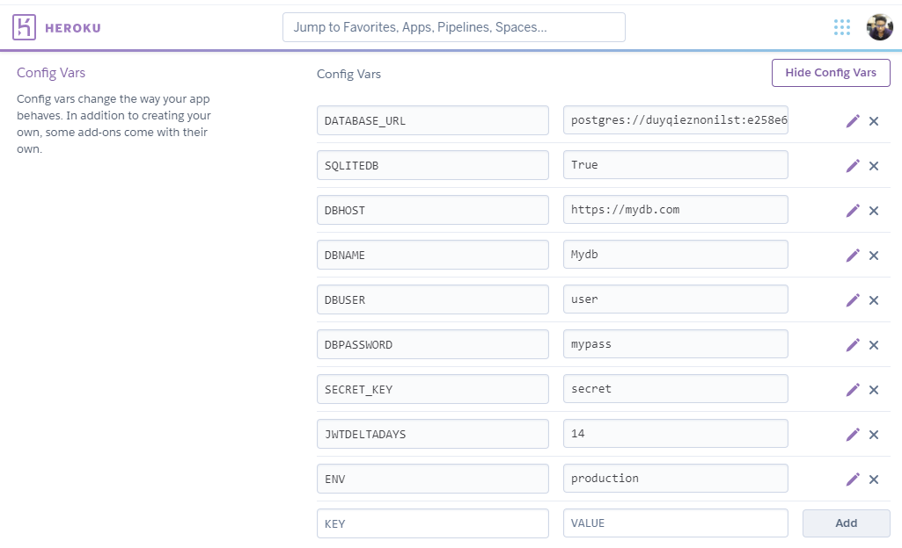

[](https://github.com/zionhaye/LabRepo)
[](https://heroku.com/deploy)

# Flask MVC Template
A template for flask applications sturcutured in the Model View Controller pattern [Demo](https://dcit-flaskmvc.herokuapp.com/)


# Dependencies
* Python3/pip3
* Packages listed in requirements.txt

# Installing Dependencies
```
$ pip3 install -r requirements.txt
```

# Configuration Mangement

**NOTE:** Before you can run this project you need to provide configuration for your application.
Configuration information such as the database url/port, credentials, API keys etc are to be supplied to the application. 
However, it is bad practice to stage such information in publicly visible repositories.
Instead, all config information should provided by manually bringing a config file into the workspace or via [environment varables](https://linuxize.com/post/how-to-set-and-list-environment-variables-in-linux/).

## In Development

When running the project in a development environment (such as gitpod) you can provide configuration via a config.py file in the App folder.
A default template config.template.py is given so to quick start you can simply rename that file to config.py (but do not save it to the repository).

By defult, the config uses a sqlite database. If you wish to connect to your own database, you must update the DBHOST, DBPASSWORD, DBUSER and DBNAME and set SQLITEDB to "False" in config.py.

## In Production

When deploying your application to a production, depending on the environment you may not be able to upload config.py (such is the case with heroku). Instead you must pass
in configuration information via enviornment variables. For heroku you need to navigate to your application's setting page (url should look like https://dashboard.heroku.com/apps/[app-name]/settings) and scroll down to config vars.
Then provide your configuration as shown in the image below. 



When deploying to production the "ENV" variable should be set to "production"

# Manage.py Commands

Manage.py is a utility script for performing various tasks related to the project. You can use it to import and test any code in the project. 
You just need create a manager command function, for example:

```
# inside manage.py


@manager.command
def hello():
    print('hello')

...    
```

Then execute the command by calling the funciton name as a parameter to the script

```
$ python3 manage.py hello
```


# Running the Project

_For development run the serve command (what you execute):_
```
$ python3 manage.py serve
```
_For production using gunicorn (what heroku executes):_
```
$ gunicorn -w 4 App.main:app
```

# Deploying
You can deploy your version of this app to heroku by clicking on the "Deploy to heroku" link above.

# Intializing the Database
When connecting the project to a fresh empty database ensure the appropriate configuration is set then file then run the following command. If you are using sqlite test.db would be created.
```
$ python3 manage.py initdb
```

# Database Migrations
If changes to the models are made, the database must be'migrated' so that it can be synced with the new models.
Then execute following commands using manage.py. More info [here](https://flask-migrate.readthedocs.io/en/latest/)

```
$ python3 manage.py db init
$ python3 manage.py db migrate
$ python3 manage.py db upgrade
$ python3 manage.py db --help
```
